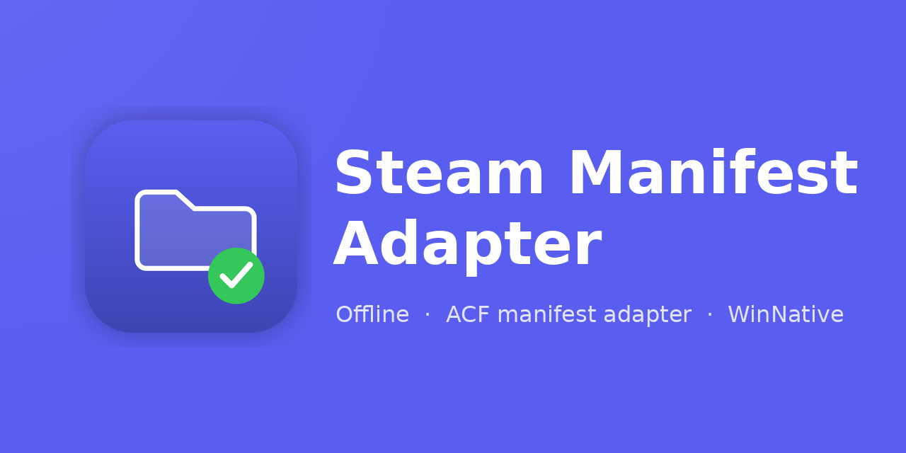

<div align="center">


# Steam Manifest Adapter

**[中文](./README.md) | English**

[](https://github.com/zFitness/steam-manifest-adapter/releases)
[](#prerequisites)
[](./LICENSE)



</div>

An offline-first open-source Android tool: it scans Steam game directories downloaded by the GameHub emulator, reads the `steamapps/appmanifest_<appid>.acf` manifest files, and adapts the game directories into a state WinNative can recognize (removing `.download_in_progress` and creating `.download_complete`).

> Read Steam `appmanifest_*.acf` files and adapt existing Steam game directories for WinNative.

## What problem does it solve

Steam game directories downloaded by the GameHub emulator contain `appmanifest_*.acf` files, but lack the `.download_complete` marker WinNative needs to recognize existing games, so WinNative cannot scan and identify them directly. This tool uses the ACF manifests to determine which Steam game lives in which directory, then adds the directory markers WinNative expects so the existing games get recognized.

Adaptation pipeline:

```text
Steam appmanifest_*.acf
        ↓ read & validate
Steam game directories in GameHub emulator
        ↓ write the directory markers WinNative needs
WinNative scans and recognizes the games
```

## Core features

- Pick the GameHub emulator's Steam game root via the system directory picker (Android Storage Access Framework)
- Scan ACF manifests and list recognized games (name, AppID, directory state, adaptability)
- Select one or more games and adapt each into the directory state WinNative currently recognizes
- Per-game results: success, already adapted, skipped (with reason), or failed (with reason)
- Games with abnormal `StateFlags` are always skipped with an explanation — no "force convert" option
- Built-in WinNative setup guide, GameHub directory requirements, and FAQ
- Fully offline: nothing is uploaded to any server
- Localization: follow system / Simplified Chinese / English

## What it does NOT do

- No game downloading, updating, verifying, or uninstalling
- No Steam login; never reads or stores passwords, cookies, or tokens
- Never modifies game files, rewrites ACF content, or renames game directories
- Never modifies the WinNative database, fetches Steam PICS info, or locates game executables automatically
- No root support, no access to Android private directories (`Android/data/`, `/data/data/`), no all-files storage permission
- No GameNative support in the first release

## Download

Get the latest `steam-manifest-adapter-v*.apk` from [GitHub Releases](https://github.com/zFitness/steam-manifest-adapter/releases), transfer it to your phone, and allow "Install unknown apps" when prompted (arm64 only, Android 7.0+).

## Prerequisites

- An Android device with the GameHub emulator installed and Steam games downloaded through it
- Game directories located where the system file picker can access them (private directories are not supported)
- WinNative installed, with the related setup completed per the in-app guide

## Development

Stack: Expo SDK 57 + React Native + TypeScript, UI components by [HeroUI Native](https://github.com/heroui-inc/heroui-native), package manager: pnpm.

```bash
# Install dependencies
pnpm install

# Build and run on Android
npm run android

# Checks
npm run lint
npx tsc --noEmit
npm test
```

## Release

Pushing a git tag like `v1.0.0` triggers a GitHub Actions workflow that builds a signed APK and creates a GitHub Release. Signing secrets must be configured before the first release — see [发布与构建](./my-docs/发布与构建.md) (Chinese).

## Disclaimer

This is an unofficial open-source tool with no official affiliation with Steam, WinNative, the GameHub emulator, or any emulator supported in the future. You use it at your own risk; make sure you have legitimate rights over the game directories you operate on.

## License

[MIT](./LICENSE)
